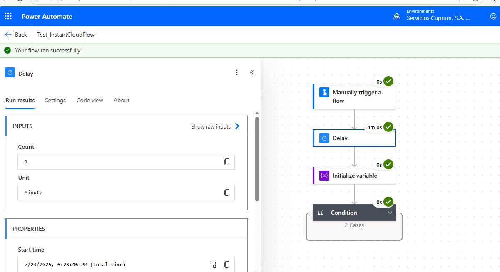
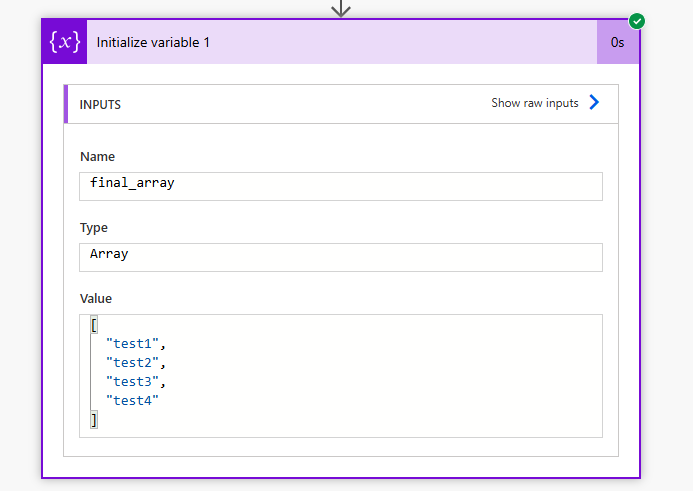
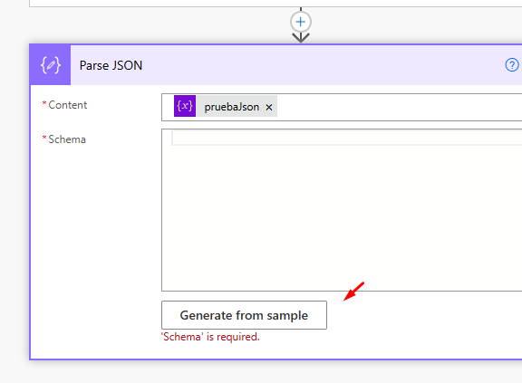

# UDY-PowerAutomate

## Conectores 

#### Actions

- Input
- Delay 
- Delay Unitil (Parate hasta que se cumpla alguna condicion)
- Initialize Variable
- Increment Variable
- Decrement Variable
- Set Variable
- Append to string variable (Despues de este se pone el Compose para que se muestre la concatenacion de string)
- Compose  Anexar strings a una cadena ya existente
- Append to array variable (Agregarle mas elementos a una variable de array)
- Condition
- Join pertenece a Data Operation 
- Create CSV Table pertenece Data Operation 
- List rows present in a table
- Create HTML Table de Data Operation
- Send a Email (V2) de Office 365 Outlook
- Parse Json de Data Operation
- Do Until de Control
- Increment Variable
- On new email (Cuando llega un nuevo correo a nuestra bandeja)

#### Expresions

- equals   Seleccione Expresions, tecleo equals y despues selecciono Contenido Dinamico y poco a poco me arma lo siguiente : equals(variables('x'), variables('y'))
- 
- 

#### Functions

- Concat
- utcNow()
- addDays()
- addHours()
- contains()
- length() Longitud de una cadena
- split() Separa en elementos de arreglo a partir de un separador
- last() Obtiene el ultimo elemento de un array
- first() Obtiene el primer elemento de un array
- substring() Cortar ciertas cadenas
- indexOf() 

#### Bibliotecas de Microsoft

- OneDrive

## Video 4


## Video 5, 6


## Video 9 Casos de Uso


## Video 10 Introduccion a la Power Platform


PowerBi


PowerApps


PowerAutomate


PowerPages


CopilotStudio - Facilita la integracion de Inteligencia Artificial

DataConector 

Dataverse - DB propia de Microsoft


## Video 11 Que es Power Automate?

Utilizar la inteligencia artifical para sacar informacion de una factura, catalogar correos dependiendo el area, ya sea finanzas, RH, Etc.

## Video 12

PowerAutomateDesktop se utiliza para automatizar tareas dentro de la maquina donde esta instalada

PowerAutomate Cloud puede ejecutar procesos en la nube e integraciones.

## Video 13 Automatizacion Web Vs RPA


## Video 14 Conectores y Aplicaciones

Un conector es un vinculo entre una plataforma externa con PowerAutomate.


## Video 15 Que es un Flujo?


## Video 16 Tipos de Flujo

- Cloud 
    - Automatizado 
        - Se ejecuta cuando hay un disparador
    - Instantaneo
        - Se ejecuta de manera manual
    - Programado
        - Es lo que se ejecuta a una hora determinada en un periodo (CRON)
- Escritorio
    - El proceso se correo dentro de la maquina donde esta instalado

## Video 17 Licencia M365


## Video 18 Inicializando Power Automate

- **Solucion**

Ejemplo.- Gracias a las soluciones de PowerAutomate, se va a poder vincular un proceso automatico de power automate con una aplicacion de power apps y que se empaqueten todas juntas para que si algun dia se tiene que migrar a otra organizacion o otro entorno y que tienen que entrar en otro proceso de ciclo de vida de aplicaciones en otro sistema de gobernaza, este todo empaquetado y junto permitiendo la mayor eficiencia


- **Mineria de Procesos**

Nos permitira analizar los puntos flacos de nuestos procesos, con la finalidad de ver donde podemos agilizarlos y hacerlos mejores

- **Centro de IA**

Crear proceso automaticos de Power Automate que incorporen inteligencia artificial de todo tipo


- **Tablas**

Son las escructuras de datos que ya vienen predefinidas 


- **Conexiones**

Se muestran las aplicaciones a las que tengo conectadas mis credenciales 
## Investigacion "Sistema de Gobernanza"

- **Colas de trabajo**

Serian como procesos que se pueden ejecutar uno detras de otro, es decir yo puedo vincular varios procesos entre si y que cuando se ejecute y finalize uno, luego se ejecute el siguiente


- **Maquinas**

Lugar donde se pueden llegar a gestionar los servidores o maquinas virtuales en las que se ejecutan los procesos de escritorio, por lo que en esa seccion se puede monitorearlas, cuales tenemos creadas.


## Investigacion "Sistema de Gobernaza"


En Power Automate, cuando se habla de un sistema de gobernanza, se refiere al conjunto de políticas, controles, roles y herramientas que una organización implementa para administrar de forma segura, eficiente y conforme el uso de los flujos (flows) y automatizaciones que los usuarios crean.

¿Qué incluye un sistema de gobernanza en Power Automate?
#### Políticas de entorno (DLP – Data Loss Prevention)
Controlan qué conectores se pueden usar juntos.

Ejemplo: Evitar que datos de SharePoint se filtren hacia Gmail o Twitter.

#### Gestión de entornos
Crear entornos separados para desarrollo, pruebas y producción.

Permite aislar flujos críticos de pruebas personales o temporales.

#### Control de acceso y roles
Definir quién puede crear flujos, administrarlos o compartirlos.

Uso de roles como Administrador de Entorno, Maker, Viewer, etc.

#### Monitoreo y auditoría
Seguimiento de qué flujos están activos, cuántas veces se ejecutan, si fallan, etc.

Uso de Power Platform Admin Center y Microsoft Purview.

#### Ciclo de vida de desarrollo
Estrategias para desplegar flujos entre entornos (desarrollo → producción).

Uso de soluciones para empaquetar y mover flujos de forma ordenada.

#### Capacitación y políticas internas
Asegurar que los usuarios sepan cómo usar Power Automate responsablemente.

Crear documentación y normas internas de buenas prácticas.

¿Por qué es importante tener gobernanza?
Sin una buena gobernanza:

Los flujos pueden volverse difíciles de mantener.

Pueden exponerse datos sensibles sin control.

Se generan duplicidades y automatizaciones ineficientes.

## Investigacion "Ejemplo de un sistema de Gobernaza"

Perfecto. Vamos a construir una estrategia de gobernanza para Power Automate paso a paso. Te presento un mapa estructurado que puedes adaptar a tu organización o equipo:

### Estrategia de Gobernanza para Power Automate
#### Definir Roles y Responsabilidades
Rol	Responsabilidad Principal
Administrador Global	Gestiona licencias, monitoreo global, acceso a todo.
Administrador de Entorno	Administra entornos, asigna roles, configura políticas DLP.
Creador de Flujos (Maker)	Desarrolla flujos dentro de los límites definidos.
Auditor / Seguridad	Revisa logs, auditorías, cumplimiento de normas.

#### Estructurar Entornos
Entorno	Uso
Desarrollo	Pruebas y creación de flujos.
QA / Validación	Validación funcional por otros usuarios.
Producción	Flujos aprobados y en uso formal.
Personal	Espacio libre para pruebas individuales.

Nota: Usa nombres claros como PROD_Finanzas, DEV_RecursosHumanos, etc.

#### Implementar Políticas de Prevención de Pérdida de Datos (DLP)
Clasifica conectores como:

Business (seguros): SharePoint, SQL, Dataverse.

Non-business (riesgosos): Twitter, Gmail, Dropbox.

Evita que se combinen conectores de distintos tipos.

Ejemplo:

plaintext
Copy
Edit
No permitir combinar SharePoint (Business) con Gmail (Non-business)
#### Uso de Soluciones
Utiliza "Soluciones" para empaquetar flujos, tablas y apps como una sola unidad.

Permite mover fácilmente automatizaciones entre entornos (DEV → QA → PROD).

Ideal para proyectos de varios desarrolladores.

#### Monitoreo y Auditoría
Herramientas clave:

Power Platform Admin Center (https://admin.powerplatform.microsoft.com/)

Microsoft Purview (auditoría y cumplimiento).

Indicadores a revisar:

Flujos fallidos o con errores.

Flujos que ejecutan acciones sensibles (ej. envíos de correo, borrado de datos).

Quién creó y comparte flujos.

#### Control de Versiones y Ciclo de Vida
Define procesos para:

Solicitar nuevos flujos.

Revisar y aprobar antes de ir a producción.

Documentar flujos y actualizaciones.

#### Documentación y Buenas Prácticas
Crear una guía interna que incluya:

Reglas de nombrado (ej. FLW_ValidarFactura_Prod)

Recomendaciones de seguridad.

Cómo reportar errores o mejoras.

#### Capacitación Continua
Dar capacitaciones mensuales o trimestrales.

Promover una comunidad interna de makers.

Compartir flujos reutilizables, tips y templates.

## Video 19 Plantillas

Son soluciones que pone a disposicion Microsoft para que podamos utilizar y agilizar el diseño de nuestros procesos automaticos


## Video 20 Conexiones

Permite ver las aplicaciones que esta utilizando las credenciales

## Video 21 Entornos

En este caso todo lo que creemos en nuestro entorno, solo sera visible por nosotros a menos que lo quieramos compartir con alguien mas los flujos, etc.

https://admin.powerplatform.microsoft.com/home

Liga para ver los entornos para Power Platform, solo si eres Admin se puede acceder a esa pantalla

https://admin.powerplatform.microsoft.com/enviroments


# Seccion 4: Crear un flujo desde cero

## Video 22 Diseñador Clasico


## Video 23, 24, 25 Flujo de nube automatico, Instantaneo, Programado

Vemos los distintos tipos de flujos que podemos crear 


## Video 26 Conexiones

## Video 32 Revisar errores


## Video 33 Pausa entre Bloques (Delay)




## Video 34 Ejecuciones Paralelas

Le damos click derecho para que salga la opcion en el signo de +


## Video 35 Clonar Procesos

Va a ver ocaciones donde tengamos muchas ramas, muchos proceso y tengamos que hacer clonaciones

Click Derecho sobre el Action
* 
Pegamos dando Click Derecho en el Boton de + y escojemos Paste an Action
* 

## Video 36 38 Crear flujos con IA


# Seccion 6 Expresiones, variables y funciones logicas

## Video 39, 40 Empezando con las variables


## Video 41 Anexar cadenas de texto


## Video 42 Anexar Matriz


Run 




## Video 43, 44 Condiciones - Parte1 y Parte2


## Video 45 Comparaciones en expresiones Parte 1

El resultado de lado izquierdo es false, y false es igual a false, ese resultado es true


## Video 46 Comparaciones en expresiones Parte 2


## Video 47 Unir distintos textos

 


## Video 48 Expresiones de tiempo - Parte 1


## Video 48 Expresiones de tiempo - Parte 2


Run


## Video 50 Palabras clave en cadens de texto


## Video 51 Length


## Video 52 First, last y last


## Video 53, 54 Substring, IndexOf


IndexOf


## Video 56 Join

Inicializmos un array


Utilizamos la accion Join, lo que hace es unirnos los elementos de un array en una cadena separados por el caracter que le pongamos, en este caso por el punto y coma


Corremos


## Video 57 CSV Table

Agregamos un array


Agregamos una accion de create table CSV


Se agrega la accion y se asigna la variable del array


Corremos


## Video 58 HTML Table

Mandar una tabla HTML para mandarlo por correo electronico

Agregar la accion "List rows present in a table"


Preparo un excel en OneDrive con una tabla


Si le damos en los 3 puntos, vemos que ya esta conectado con nuestra cuenta de OneDrive


Terminamos de agregar la referencia a nuestra tabla


Agregamos la accion Create HTML Table y agregamos los values


Si lo ejecutamos obtenemos esta resultado


Agregamos la accion para mandar un correo "Send an Email (V2)"


Corremos, y si nos damos cuenta, salen otras columnas, y eso es porque la tabla HTML la hemos creado de forma automatica


Si solo queremos los campos que se muestran en el excel


Si corremos, nos muestra esto


Si queremos una tabla con colores y mas llamativa, agregamos estilos CSS a traves de la accion Compose de Data Operation

```css
<style>
table {
  border: 1px solid #1C6EA4;
  background-color: #EEEEEE;
  width: 100%;
  text-align: left;
  border-collapse: collapse;
}
table td, table th {
  border: 1px solid #AAAAAA;
  padding: 3px 2px;
}
table tbody td {
  font-size: 13px;
}
table thead {
  background: #1C6EA4;
  border-bottom: 2px solid #444444;
}
table thead th {
  font-size: 15px;
  font-weight: bold;
  color: #FFFFFF;
  border-left: 2px solid #D0E4F5;
}
table thead th:first-child {
  border-left: none;
}
</style>
```


Corremos


## Video 59 Parse JSON

Sacar informacion de una propiedad de un Json que ya esta escructurado

- Inicializamos la variable
    - 
- Agregamos la accion `Parse to Json` y agregamos la variable y le damos click en Generate From Sample
    -  
- Pegamos la misma escructura ya que no va a cambiar la escructura
    - 
- Despues de haberle Dado en Done nos va a generar esta escructura
    - 
- Agregamos una nueva variable y en el valor, ahora vemos las propiedades de nuestro JSON, para posteriormente elegir Ciudad
    - 
    - 
- Si corremos la aplicacion 
    - 


## Video 60 Repetir hasta

- Agregamos una variable inicializada en Zero
- Agregamos la accion `Do Until` de Control y agregamos la condicion para que se detenga
    - 
- Agregamos dentro una incrementacion de variable
    - 
- Agregamos una nueva variable
    - 
- Corremos la aplicacion y en el ciclo podemos ver el valor de cada una de las variables de cada iteracion
    - 

# Seccion 7: Automatizaciones en bibliotecas de documentos y listas de elementos

## Video 61 Introduccion a las bibliotecas de documentos de Microsoft

- Por conocer.- Si nos vamos a OneDrive podemos crear flujos
    - 
- Y nos salen diferentes tipos de flujos que podemos realizar en base a la informacion que tenemos en nuestra carpeta
    - 
- Con SharePoint podemos crear sitios o noticias
    - 

## Video 62 Guardar adjuntos de un correo electronico en OneDrive - Parte 1

- Buscamos una plantilla que nos permita guardar archivos adjuntos de un correo en OneDrive 
    - **NOTA.-** Como estamos en un correo de dominio empresarial, debemos escoger una plantillas que haga referencia a un correo de dominio empresarial @cuprum.com y no a un dominio @outlook.com
        - 
        - Le Damos en continuar
        - 
- Sale esto 
    - Donde nosotros podemos poner la condicion, en este caso esta la condicion 
        - `De` para evaluar si viende de alguna persona en particular, pero tambien podemos 
        - `Body`como si en el cuerpo viente cierto campo, evaluar el nivel de importancia del correo, etc
        - `Asunto` que en el asunto detectemos cierta palabra clave
        - 
    - 
- Dentro de la condicion
    - En esta parte solo esta la logica para recibir un adjunto, pero si nos llegan 25 adjuntos por ejemplo, tendriamos que hacer el mismo proceso 25 veses, pero ahorita solo esta para una ves
    - 
    - Cambie el directorio a guardar 
        - Es muy importante que mappeemos correctamente los attachments en su correspondiente campo para que funcione
            - 
            - 
            - 
    - En caso de que sea `FALSE` guardamos los adjuntos en otra carpeta
        - 
- Corremos el flujo
- Eviamos un correo
    - 
- Verificamos en nuestra carpeta de OneDrive
    - 

