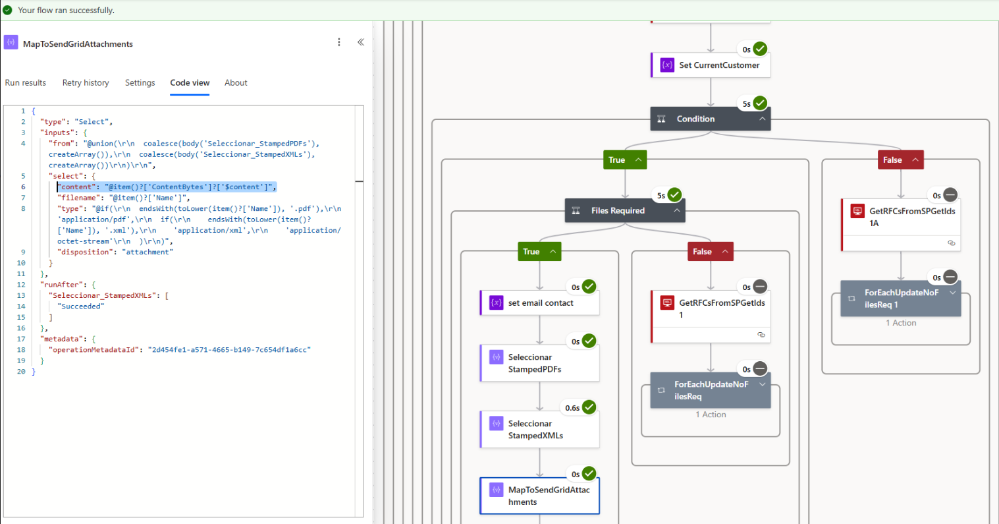

# Acceso a datos del flujo (súper-práctico)

**https://learn.microsoft.com/en-us/azure/logic-apps/expression-functions-reference?utm_source=chatgpt.com**

| ¿Qué quieres?                                    | Sintaxis                                 | Ejemplo                                    | Nota                                                                                                                                                                                                                                                                                                                                                                                                         |
| -------------------------------------------------- | ---------------------------------------- | ------------------------------------------ | ------------------------------------------------------------------------------------------------------------------------------------------------------------------------------------------------------------------------------------------------------------------------------------------------------------------------------------------------------------------------------------------------------------ |
| Cuerpo de un**trigger**                      | `triggerBody()`                        | `triggerBody()?['AccountId']`            | Igual que `triggerOutputs()?['body']…`;`triggerOutputs()`también deja leer **headers** .[Microsoft Learn](https://learn.microsoft.com/en-us/azure/logic-apps/expression-functions-reference?utm_source=chatgpt.com)[D365 Demystified](https://d365demystified.com/2020/09/06/using-triggerbody-triggeroutput-to-read-cds-trigger-metadata-attributes-in-a-flow-power-automate/?utm_source=chatgpt.com) |
| **Outputs**de una acción                    | `body('Accion')`/`outputs('Accion')` | `body('Get_items')?['value']`            | `outputs()`da acceso a `headers`y `body`.[Microsoft Learn](https://learn.microsoft.com/en-us/azure/logic-apps/expression-functions-reference?utm_source=chatgpt.com)                                                                                                                                                                                                                                      |
| **Fila actual**en un `Apply to each`       | `item()`                               | `item()?['Name']`                        | Dentro del bucle `Apply to each`.[Microsoft Learn](https://learn.microsoft.com/en-us/power-automate/apply-to-each?utm_source=chatgpt.com)[Ellis Karim&#39;s Blog](https://elliskarim.com/2021/07/14/item-v-itemsapply_to_each/?utm_source=chatgpt.com)                                                                                                                                                           |
| **Fila del bucle X**(desde fuera/otro nivel) | `items('NombreDelBucle')`              | `items('Apply_to_each')?['ReceiverRFC']` | Equivale a `item()`dentro del bucle.[Ellis Karim&#39;s Blog](https://elliskarim.com/2021/07/14/item-v-itemsapply_to_each/?utm_source=chatgpt.com)                                                                                                                                                                                                                                                             |
| **Variables**                                | `variables('nombre')`                  | `variables('str_nombre')`                | Lee el valor actual.[Microsoft Learn](https://learn.microsoft.com/en-us/azure/logic-apps/expression-functions-reference?utm_source=chatgpt.com)                                                                                                                                                                                                                                                                 |
| **Parámetros**del flujo/solution            | `parameters('p')`                      | `parameters('Ambiente')`                 | Muy útil con Solutions/EV.[Microsoft Learn](https://learn.microsoft.com/en-us/azure/logic-apps/expression-functions-reference?utm_source=chatgpt.com)                                                                                                                                                                                                                                                          |
| **Resultado de un Scope/Until/ForEach**      | `result('ScopeName')`                  | `result('Scope_Main')`                   | Devuelve inputs/outputs de las acciones internas.[Microsoft Learn](https://learn.microsoft.com/en-us/azure/logic-apps/expression-functions-reference?utm_source=chatgpt.com)                                                                                                                                                                                                                                    |

> Consejo: camino “tipo ruta” también sirve, p. ej. `triggerOutputs()?['body/Customer/Name']`. [D365 Demystified](https://d365demystified.com/tag/triggeroutputs/?utm_source=chatgpt.com)

# Acceso a datos de acciones: comparativa rápida

| ¿Qué quieres?                            | Sintaxis                                               | Ejemplo (acción llamada**HTTP_SendGrid_SendMail** )            | Notas/uso recomendado                                                                                                                                  |
| ------------------------------------------ | ------------------------------------------------------ | --------------------------------------------------------------------- | ------------------------------------------------------------------------------------------------------------------------------------------------------ |
| **Objeto completo**de una acción    | `actions('Accion')`                                  | `actions('HTTP_SendGrid_SendMail')`                                 | Devuelve un objeto con `inputs`,`outputs`,`startTime`,`endTime`,`trackingId`, etc. Útil para inspección avanzada.                          |
| **Outputs**(cuerpo+headers+status)   | `actions('Accion').outputs`                          | `actions('HTTP_SendGrid_SendMail').outputs`                         | Equivalente a `outputs('HTTP_SendGrid_SendMail')`. Con**punto**navegas propiedades, pero no hay “safe navigation” (`?`).                   |
| **Body**del output                   | `actions('Accion').outputs.body`                     | `actions('HTTP_SendGrid_SendMail').outputs.body`                    | Equivale a `body('HTTP_SendGrid_SendMail')`. Si el body pudiera ser nulo, prefiere notación con corchetes y `?`(ver fila de abajo).               |
| **Propiedad dentro del body**        | `actions('Accion').outputs.body.<prop>`              | `actions('Get_items').outputs.body.value`                           | Para keys**sin**guiones/espacios. Si la propiedad tiene guiones o puede ser nula, usa corchetes:`actions('X')?['outputs']?['body']?['value']`. |
| **Header específico**               | `actions('Accion').outputs.headers['Nombre-Header']` | `actions('HTTP_SendGrid_SendMail').outputs.headers['Content-Type']` | Para headers con guiones**debes**usar `['…']`. Con “safe navigation”:`actions('X')?['outputs']?['headers']?['Content-Type']`.             |
| **Status code**                      | `actions('Accion').outputs.statusCode`               | `actions('HTTP_SendGrid_SendMail').outputs.statusCode`              | Muy útil en condiciones o scopes de error.                                                                                                            |
| **Equivalente compacto (solo body)** | `body('Accion')`                                     | `body('HTTP_SendGrid_SendMail')?['value']`                          | Más breve para leer el**body** . Soporta `?`con corchetes.                                                                                    |
| **Equivalente genérico (outputs)**  | `outputs('Accion')`                                  | `outputs('HTTP_SendGrid_SendMail')?['headers']?['Content-Type']`    | Versátil y**seguro**con `?`+corchetes; preferible cuando puede haber nulos.                                                                   |

## Ejemplos listos para pegar

* **Propiedad de body (sin nulos)**
  <pre class="overflow-visible!" data-start="2192" data-end="2243">

<code class="whitespace-pre!">actions('Get_items').outputs.body.value
  </code>

</pre>
* **Propiedad de body (defensivo con nulos)**
  <pre class="overflow-visible!" data-start="2294" data-end="2357">

<code class="whitespace-pre!">actions('Get_items')?['outputs']?['body']?['value']
  </code>

</pre>
* **Header con guiones (defensivo)**
  <pre class="overflow-visible!" data-start="2399" data-end="2472">

<code class="whitespace-pre!">actions('HTTP_Call')?['outputs']?['headers']?['Content-Type']
  </code>

</pre>
* **Status code para condición**
  <pre class="overflow-visible!" data-start="2510" data-end="2574">

<code class="whitespace-pre!">equals(actions('HTTP_Call').outputs.statusCode, 200)
  </code>

</pre>
* **Equivalente con `outputs()` (recomendado si puede ser nulo)**
  <pre class="overflow-visible!" data-start="2645" data-end="2705">

<code class="whitespace-pre!">outputs('HTTP_Call')?['headers']?['Retry-After']
  </code>

</pre>
* **Solo body con `body()`**
  <pre class="overflow-visible!" data-start="2739" data-end="2791">

<code class="whitespace-pre!">body('Parse_JSON')?['Customer']?['Name']
  </code>

</pre>

## ¿Cuándo usar `actions()` vs `outputs()` / `body()`?

* Usa **`actions()`** cuando necesites **más metadatos** de la acción (tiempos, trackingId, inputs/outputs completos) o te resulte más legible encadenar con  **puntos** .
* Usa **`outputs()` / `body()`** cuando quieras expresiones **más cortas** y, sobre todo, cuando necesites **“safe navigation”** con `?` y **corchetes** para evitar errores por valores nulos o keys con guiones/espacios.

> ⚠️ Con la notación de **puntos** (`.`) no puedes poner `?` entre segmentos. Si hay riesgo de `null`, cambia a **corchetes** con `?`:
>
> `actions('A')?['outputs']?['body']?['prop']`

# item() contexto dentro de un Map que esta dentro de un ForEach

Buen ojo. Esa parte seleccionada está dentro de un **Select** (no dentro de un  *Apply to each* ), y el **Select itera internamente** sobre el array que pusiste en  **From** :

<pre class="overflow-visible!" data-start="173" data-end="319">

<code class="whitespace-pre! language-text">From = union(
  coalesce(body('Seleccionar_StampedPDFs'), createArray()),
  coalesce(body('Seleccionar_StampedXMLs'), createArray())
)
</code>

</pre>

Así que:

* **`item()`** aquí se refiere al **elemento actual de esa iteración del Select** (cada objeto proveniente de la unión de PDFs + XMLs).
* No está “tomando el elemento actual del foreach”; es el  **elemento actual del propio Select** .

En el mapeo:

<pre class="overflow-visible!" data-start="579" data-end="903">

<code class="whitespace-pre! language-json">"content":"@item()?['ContentBytes']?['$content']",
"filename":"@item()?['Name']",
"type": "@{if( endsWith(toLower(item()?['Name']), '.pdf'), 'application/pdf',
          if( endsWith(toLower(item()?['Name']), '.xml'), 'application/xml',
              'application/octet-stream'))}",
"disposition":"attachment"
</code>

</pre>

Qué hace cada uno:

1. **`content`**
   * Accede a la propiedad **anidada** del elemento actual: `ContentBytes.$content`.
   * Eso es el **Base64** del archivo (Power Automate envuelve binarios como `{ "content-type": "...", "$content": "..." }`).
2. **`filename`**
   * Toma el nombre del archivo del elemento actual: `Name`.
3. **`type`**
   * Calcula el **content-type** según la extensión del `Name`:
     * `.pdf` → `application/pdf`
     * `.xml` → `application/xml`
     * otro → `application/octet-stream` (genérico).
4. **`disposition`**
   * Lo fija como `"attachment"` (lo que SendGrid espera para adjuntos).

Resumen: el **Select** combina las dos listas (PDFs+XMLs), **itera** sobre cada item (eso es `item()`), y **mapea** a la forma que necesita SendGrid para  **attachments** .

# Caso de acceder a un Elemento del Foreach dentro de un Action Select

###### ChatGPT said:

Muy buena pregunta 👌.

En  **Power Automate** , cuando estás en un **Select** (como en tu caso), el `item()` hace referencia  **solo al objeto actual de ese Select** , no al *For each* externo.

Si quieres traer dentro del **map** del Select un valor que proviene de un **For each** (o de cualquier otro contexto externo), tienes que:

---

### 🔑 Forma de acceder a la propiedad del *For each* externo

* Usar la función `items('<nombre_del_for_each>')` → esto apunta al  **ítem actual de ese For each** .
* Ejemplo si tu *For each* se llama `ForEach_Customers`:

<pre class="overflow-visible!" data-start="568" data-end="621">

<code class="whitespace-pre! language-text">items('ForEach_Customers')?['CustomerId']
</code>

</pre>

Eso devolverá la propiedad `CustomerId` del objeto en el bucle externo.

---

### 🚀 Cómo combinarlo con tu `Select`

Supongamos que tu Select está generando los adjuntos para SendGrid y quieres incluir, por ejemplo, el `CustomerId` que viene del *For each* externo:

<pre class="overflow-visible!" data-start="890" data-end="1054">

<code class="whitespace-pre! language-json">{
  "content":"@item()?['ContentBytes']?['$content']",
  "filename":"@item()?['Name']",
  "customerId":"@items('ForEach_Customers')?['CustomerId']"
}
</code>

</pre>

---

### ⚡ Ejemplo práctico

1. *For each* recorre clientes.
2. Dentro del For each haces un Select para mapear los PDFs/XMLs de ese cliente.
3. En el Select usas:
   * `item()` → cada archivo (PDF/XML).
   * `items('ForEach_Customers')?['CustomerName']` → nombre del cliente actual.

Así podrías armar algo como:

<pre class="overflow-visible!" data-start="1380" data-end="1647">

<code class="whitespace-pre! language-json">{
  "content":"@item()?['ContentBytes']?['$content']",
  "filename":"@item()?['Name']",
  "type":"@{if(endsWith(toLower(item()?['Name']), '.pdf'),'application/pdf','application/xml')}",
  "customerName":"@items('ForEach_Customers')?['CustomerName']"
}
</code>

</pre>

---

👉 Con esto tu Select “hereda” datos del **ítem actual externo** (For each) y los mezcla con lo que trae internamente.
