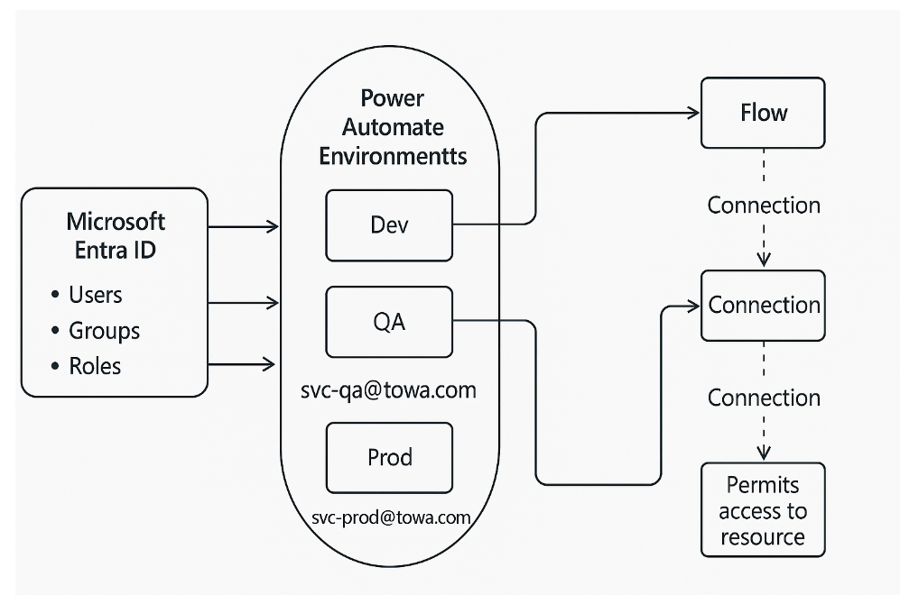

## 🔹 ¿Qué es  **Microsoft Entra ID** ?

* Es el nuevo nombre de lo que antes se conocía como  **Azure Active Directory (Azure AD)** .
* Es el **servicio de identidad y control de acceso** de Microsoft en la nube.
* Permite:
  * Crear y administrar **usuarios** y **grupos** de tu organización.
  * Definir **roles** y  **permisos** .
  * Manejar **aplicaciones registradas** (ej. Power Automate, Power Apps, Dynamics, etc.).
  * Implementar  **Single Sign-On (SSO)** , **MFA** (multi-factor authentication),  **condicional access policies** , etc.

En pocas palabras:  **Entra ID es la base de seguridad y autenticación de todo lo que hagas en Microsoft 365, Power Platform y Azure** .

---

## 🔹 Relación con **Ambientes de Power Automate**

Los **ambientes en Power Platform** (Dev, QA, Prod) están siempre ligados a un  **tenant de Entra ID** . La relación funciona así:

1. **El Tenant (Entra ID)**
   * Es como la "empresa madre".
   * Contiene todos los usuarios y permisos.
   * Cada usuario que entra a Power Automate pasa primero por Entra ID para validar identidad.
2. **Los Ambientes de Power Automate**
   * Se crean dentro del **mismo tenant** de Entra ID.
   * Cada ambiente hereda la seguridad del tenant, pero además puedes configurar  **roles adicionales por ambiente** :
     * **Environment Admins** → administran el ambiente completo.
     * **System Customizers / Makers** → pueden crear apps y flujos.
     * **Users** → solo usan lo publicado.
3. **Conexiones y permisos**
   * Cuando en un flow haces un  **HTTP con OAuth** , una **conexión a SharePoint** o  **SQL Azure** , en el fondo quien valida las credenciales es Entra ID.
   * Ejemplo: Si usas una  **cuenta de servicio svc-qa** , esa cuenta debe existir en **Entra ID** y tener permisos para el ambiente de QA y para los recursos que consumirá.
4. **Gobernanza entre ambientes**
   * Entra ID es clave para que solo los usuarios correctos puedan:
     * Importar soluciones de Dev → QA → Prod.
     * Usar las **cuentas de servicio** para conexiones.
     * Restringir quién puede **crear ambientes** (por default cualquiera puede, pero lo recomendable es que TI lo limite desde Entra ID / Power Platform Admin).

---

## 🔹 Ejemplo práctico

* Tu empresa **Towa** tiene un tenant en Entra ID: `towa.com`.
* Entra ID contiene:
  * Usuarios: `juan@towa.com`, `svc-qa@towa.com`, `svc-prod@towa.com`.
  * Grupos: `PowerPlatformAdmins`, `QAUsers`, `ProdUsers`.
* En Power Platform Admin creas ambientes:
  * **Dev** → accesible para todos los developers.
  * **QA** → accesible solo para testers y la cuenta `svc-qa`.
  * **Prod** → accesible solo para negocio + `svc-prod`.
* Cuando publicas un flow que usa SQL, al importarlo a QA:
  * La CR (connection reference) se asigna a la conexión hecha con `svc-qa`.
  * Entra ID valida que `svc-qa` exista, tenga licencia, y permisos en el ambiente y en SQL.

---

✅ Conclusión:  **Microsoft Entra ID es la columna vertebral de identidad y seguridad de los ambientes de Power Automate** .

* Sin Entra ID no hay usuarios, permisos ni conexiones.
* Los ambientes viven dentro de un tenant de Entra ID.
* Las cuentas de servicio de QA y Prod son *usuarios especiales en Entra ID* que se asignan a sus respectivos ambientes.

### 🔹 Ambientes en Power Platform

* Los **ambientes (Dev, QA, Prod)** son espacios lógicos dentro de  **tu tenant de Microsoft Entra ID** .
* No dependen de la cuenta personal o de servicio, sino del  **tenant** .

  ➝ Es decir, si tienes el ambiente QA en tu tenant, tanto tu cuenta personal como la cuenta de servicio de QA pueden acceder al mismo ambiente (según permisos).
* Comparten la misma **DB de Dataverse** si está habilitado para ese ambiente.

---

### 🔹 Cuentas personales vs. cuentas de servicio

* **Cuentas personales (desarrolladores)** : acceden a todos los ambientes (Dev, QA, Prod), con permisos de **Maker** en Dev y acceso restringido en QA/Prod.
* **Cuenta de servicio QA** : se le da mínimo acceso al ambiente de QA, para que ejecute los flujos y conexiones en ese entorno.
* **Cuenta de servicio Prod** : igual, pero solo en Prod. Así se asegura que todo lo que corre en producción use credenciales controladas.

---

### 🔹 Ejemplo práctico

1. Tú desarrollas en el ambiente **Dev** con tu cuenta personal.
2. Empaquetas la **solución** y la exportas/importas al ambiente **QA** (con parámetros de conexión apuntando a la DB/URL de QA).
3. Haces pruebas usando la  **cuenta de servicio QA** .
4. Cuando todo pasa QA, se importa la solución a  **Prod** , donde la ejecuta la  **cuenta de servicio Prod** .

---

👉 Entonces sí, **los ambientes son compartidos** entre las cuentas (no se duplican por cada cuenta). Lo que cambia es **qué permisos** le das a cada cuenta dentro de cada ambiente.
