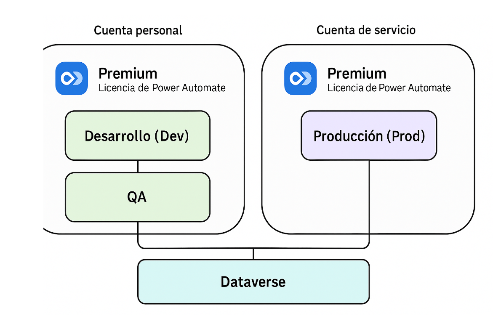
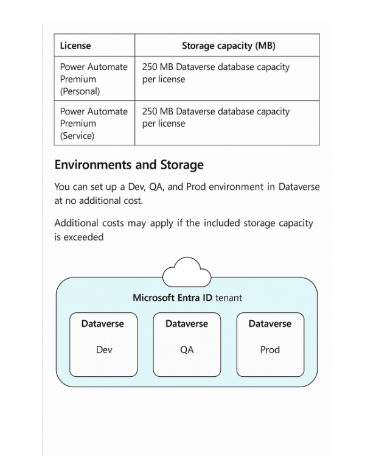

Aquí tienes el flujo con **almacenamiento y Dataverse a nivel tenant** explicado de forma gráfica y conceptual:

---

## 🔹 Estructura General

* **Tenant (Microsoft Entra ID)**
  * Es el contenedor principal de tu organización.
  * Todos los **ambientes** viven dentro de un mismo tenant.

---

## 🔹 Ambientes dentro del Tenant

Cada ambiente (Dev, QA, Prod) es independiente:

* **Dev** → pruebas y desarrollo de soluciones.
* **QA** → validación y control de calidad.
* **Prod** → ambiente en vivo donde los flujos se ejecutan para usuarios finales.

Cada uno:

* Tiene **su propio Dataverse** (no se comparte entre ambientes).
* Guarda **apps, flows, chatbots y datos** en un espacio separado.

---

## 🔹 Almacenamiento de Dataverse

El **Dataverse** de cada ambiente consume  **capacidad de almacenamiento** , dividida en:

* **Base de datos** (almacena tablas, registros).
* **Archivos** (almacena adjuntos, documentos).
* **Logs** (registro de auditoría).

---

## 🔹 Relación con Licencias

* La **licencia Power Automate Premium** de tu cuenta o cuenta de servicio **incluye cierta capacidad de Dataverse** (por tenant).
* Esa capacidad es compartida entre todos los ambientes.
* Si un ambiente necesita más capacidad de la disponible → se debe comprar almacenamiento adicional.

---

## 🔹 Flujo de Uso

1. **Tenant (Entra ID)** → contenedor global.
2. **Ambientes (Dev, QA, Prod)** → cada uno con su Dataverse independiente.
3. **Storage Pack** (incluido con licencias + almacenamiento extra si es necesario).
4. Los **flujos y soluciones** de cada ambiente consumen de ese almacenamiento.

---

👉 En la imagen que generé, se muestra justo esto: el tenant como paraguas, con Dev/QA/Prod debajo, cada uno con su propio Dataverse y todos consumiendo la capacidad total de almacenamiento asignada al tenant.

