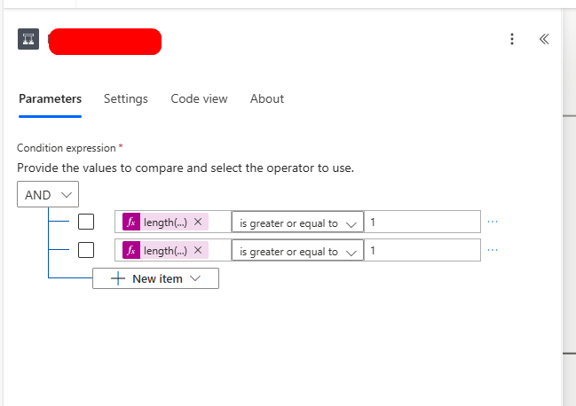

# Actions

El nombre del objeto tiene que ser abreviado

* Verbo + Objeto + Contexto
* Prefijo - camelCase
  * action
* Objeto - PascalCase
  * Origen
* **Contexto - PascalCase**
  * Se nombra como si fuera una variable
  * Con la finalidad de que el action sea como el nombre de la variable
  * Se debe utilizar los prefijos Get, Post, Filter, Delete, etc
    * No se tiene que dar contexto ni de donde viene y para que se utiliza, tiene que ser muy consiso el nombre
      * RFCs
      * Clientes
      * ClientesEliminados
      * ClientesPremium

Ejemplo

* sql_hubFac_GetRFCs

Formato:

# Action SQL

<pre class="overflow-visible!" data-start="297" data-end="339">

<code class="whitespace-pre!">sql_<Área/Módulo>_<Acción/Entidad>
</code>

</pre>

Ejemplos:

* `sql_hubFac_GetRFCs` → ejecuta SP para obtener RFCs.
* `sql_finanzas_GetFacturasPendientes` → consulta facturas.
* `sql_ventas_InsertPedido` → inserta un pedido en tabla de ventas.

# Conditions

* Si se evalua una salida de un Action
  * if_fuente_QueValida
  * se pone el nombre del action tal cual sin guiones como fuente
  * la pregunta (HasItems, IsOverdue, IsSuccess)
    * Que el action no lleve guion bajo
    * if_sqlHubFacGetRFCs_HasItems

Ejemplos:

* `if_hubFacRFCs_HasItems` → valida si hay RFCs en la respuesta.
* `if_facturas_IsOverdue` → valida si la factura está vencida.
* `if_response_IsSuccess` → valida si la API respondió 200 OK.

Si en algun punto llegara a poner muchas condiciones, el nombre no seguiria esta nomenclatura, si no que seria un nombre descriptivo corto, 

* Ejemplo
  * TieneContactsElCustomer
  * HasContactTheCustomer
    * Esto ya que el Customer es un objeto que dentro tiene una propiedad que se llama Contacts
      * 

##### **Pero por temas de debugueo en PowerAutomate es mas facil y mas recomendable NO poner muchas condiciones en un IF para la facil lectura, mantenimiento, analisis de los datos y debuggeo.**

Puede que sea facil de entender si pongo en el if varias condiciones pero que siempre se hagan sobre el mismo objeto, por ejemplo aqui valida que el customer si se le pueda enviar facturas y ademas que tenga contactos

En caso de que sean muchos IFs concatenados, tal ves si convenga poner un o dos IFs con varias condiciones

# Apply to each

* `foreach_<Plural>`
* foreach_fuente
* se pone el nombre tal cual del action sin guiones o de la variable
* foreach_sqlHubFacGetRFCs

# Filter

* filter_`<Fuente>`_`<Criterio>`
* Como la fuente es un action, de ese nombre se le eliminan los guiones si es que viene de un action la fuente
  * filter_httpGetCustomers_FindByRFC
